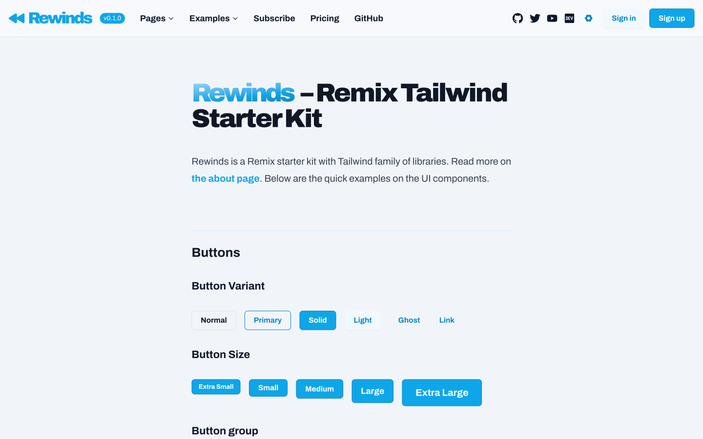
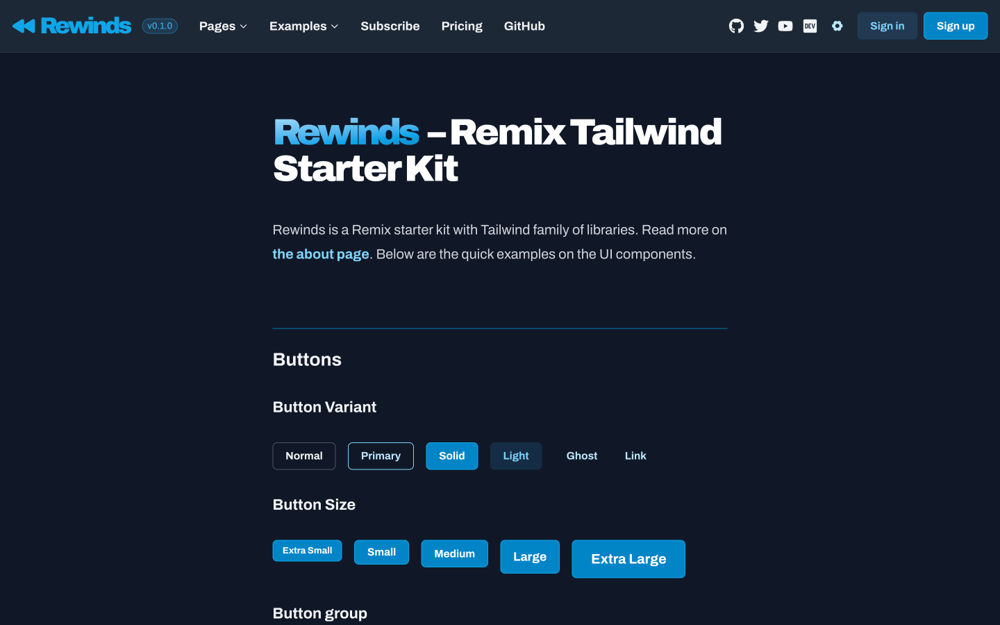

# Rewinds – Remix Tailwind Starter Kit


Rewinds is a Remix starter kit with Tailwind CSS v3 family of libraries.

This is an example demo to combine the best Tailwind-related ecosystem such as Tailwind CSS, Headless UI, Radix UI, Vechai UI, and more.

Visit the live demo: [rewinds.mhaidarhanif.com](https://rewinds.mhaidarhanif.com)

> Note that this repo is ongoing active development

## Screenshots

<div style="max-width: 720px;">

[](https://rewinds.mhaidarhanif.com)

[](https://rewinds.mhaidarhanif.com)

</div>

## Table of Contents

- [Screenshots](#screenshots)
- [Features](#features)
- [Stacks](#stacks)
  - [Core](#core)
  - [Frontend](#frontend)
  - [Utility](#utility)
  - [Deployment](#deployment)
- [Development](#development)
  - [Install dependencies](#install-dependencies)
  - [Environment variables](#environment-variables)
  - [Environment variables using Doppler](#environment-variables-using-doppler)
  - [Project structure](#project-structure)
- [Build](#build)
- [Lint](#lint)
- [Deployment](#deployment-1)
- [Notes](#notes)
  - [Remix](#remix)
  - [Tailwind CSS](#tailwind-css)
  - [Vechai UI](#vechai-ui)
  - [ConvertKit](#convertkit)

## Features

- Remix as the React framework
- Tailwind CSS using Vechai UI as primary components
- Multiple themes switcher and persist theme with a session cookie
- Only focus on the frontend styling and project structure, without particular in testing and database
  - Only a bit of backend integration through Remix loader
  - For the full stack integration, check out the official Remix Stacks instead: https://remix.run/stacks
- More features listed in [the about page](https://rewinds.mhaidarhanif.com/about)

Note: Depending on your computer processing power, the first Tailwind compilation might take around ~3 seconds. Although Tailwind CSS v3 already has Just-in-Time engine enabled by default.

- https://tailwindcss.com/blog/just-in-time-the-next-generation-of-tailwind-css
- https://tailwindcss.com/docs/upgrade-guide#migrating-to-the-jit-engine

## Stacks

Check the complete tech stack in the [the about page](https://rewinds.mhaidarhanif.com/about)

### Core

- TypeScript v4.6
- Node.js v14-v17
- npm v8
- React v18
- Remix v1.4

### Frontend

- Tailwind CSS v3
  - Tailwind CSS plugins
- PostCSS v8
- Fonts
  - Google Fonts
  - Fontbit CDN
- Icons
  - React Icons
  - Heroicons v1
  - Font Awesome
  - Phospor Icons
- Components
  - Headless UI v1 – Unstyled accessible UI components
  - Radix UI v0 – Unstyled accessible UI components
    - Tailwind Radix
  - Vechai UI v0 – React Tailwind CSS components
  - NProgress

### Utility

- ESLint v8
- Prettier v2
- `clsx` aliased as `classx`
- `urql` and `graphql-request`
- `axios`

### Deployment

- Vercel

## Development

To run your Remix app locally, make sure your project's local dependencies are installed:

### Install dependencies

```sh
npm install
```

### Environment variables

Copy the `.env.example` into `.env`:

```sh
cp .env.example .env
# Edit .env as you prefer
```

Setup the environment variables here and Vercel if want to deploy there.
If you don't need some of these, you can remove them in the `.env`, `app/utils/env.server.ts`, and all `getEnvServer()` function calls.

Afterwards, run the Remix development server with the `dev` script.

```sh
npm run dev
```

It will compile both the Tailwind styles and Remix app.
Finally, open up [http://localhost:3000](http://localhost:3000) and you should be ready to go!

Note if you're used to using the `vercel dev` command provided by [Vercel CLI](https://vercel.com/cli) instead, you can also use that, but it's not needed.

### Environment variables using Doppler

If you want to use [Doppler](https://doppler.com) to manage the env variables, use the `start` script. Therefore this won't need the `.env` file to be edited manually.

```sh
npm run start
# doppler run -- npm run dev
```

### Project structure

- `.vscode`
- `api`
- `app`
  - `components`
  - `configs`
  - `contents`
  - `data`
  - `features`
  - `hooks`
  - `layouts`
  - `libs`
  - `routes`
  - `styles`
  - `types`
  - `utils`
  - `entry.client.tsx`
  - `entry.server.tsx`
  - `root.tsx`
  - `other-root-routes.server.ts`
- `public`
- `styles`
  - `global.css`
- `.env`
- `.env.example`
- `.eslintrc`
- `.eslintignore`
- `.gitignore`
- `.prettierrc`
- `.prettierignore`
- `package.json`
- `postcss.config.js`
- `README.md`
- `remix.config.js`
- `remix.env.d.ts`
- `server.js`
- `tailwind.config.js`
- `tsconfig.json`
- `vercel.json`

## Build

Make sure that it can build just fine:

```sh
npm run build
```

## Lint

Make sure to lint the code with ESLint:

```sh
npm run lint
```

## Deployment

After having run the `create-remix` command and selected "Vercel" as a deployment target, you only need to [import your Git repository](https://vercel.com/new) into Vercel, and it will be deployed.

If you'd like to avoid using a Git repository, you can also deploy the directory by running [Vercel CLI](https://vercel.com/cli):

```sh
npm i -g vercel
vercel
```

It is generally recommended to use a Git repository, because future commits will then automatically be deployed by Vercel, through its [Git Integration](https://vercel.com/docs/concepts/git).

## Notes

### Remix

If you have older way of importing from `remix` package prior to `remix@1.4.3, you can use the `migrate` script to change the import statements.

```sh
npx remix migrate --migration replace-remix-imports
```

Before:

```jsx
import { json } from "remix";
```

After:

```jsx
import { json } from "@remix-run/node";
```

### Tailwind CSS

Note that [Tailwind CSS IntelliSense extension](https://marketplace.visualstudio.com/items?itemName=bradlc.vscode-tailwindcss) might currently not work with `tailwindcss@3.0.24` at the moment.

### Vechai UI

Edit `tailwind.config.js` to remove custom colors to reduce the stylesheet build size. `cssBase` is still required to get the default Tailwind CSS colors into Vechai UI themes.

```diff
module.exports = {
  // ...
  theme: {
    extend: {
      colors: {
-       info: colors.blue,
-       success: colors.green,
-       warning: colors.yellow,
-       error: colors.red,
      },
    },
  },
  plugins: [
    // ...
   require('@vechaiui/core')({
     cssBase: true,
-    colors: ['info', 'success', 'warning', 'error'],
   }),
  ],
};
```

### ConvertKit

1. Sign up a new account on ConvertKit
2. Edit your profile information
3. Get the API Key to be used as `CONVERTKIT_API_KEY`
4. Create a Subscribe Form
5. Get the Form ID to be used as `CONVERTKIT_FORM_ID`

Tips:

- Setup the Mailing Address: https://help.convertkit.com/en/articles/2502494-alternatives-for-your-physical-address
